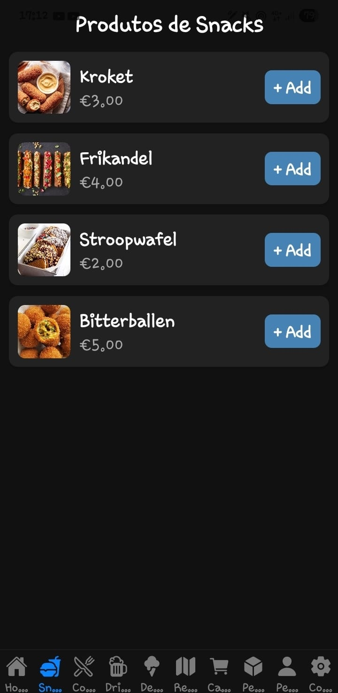
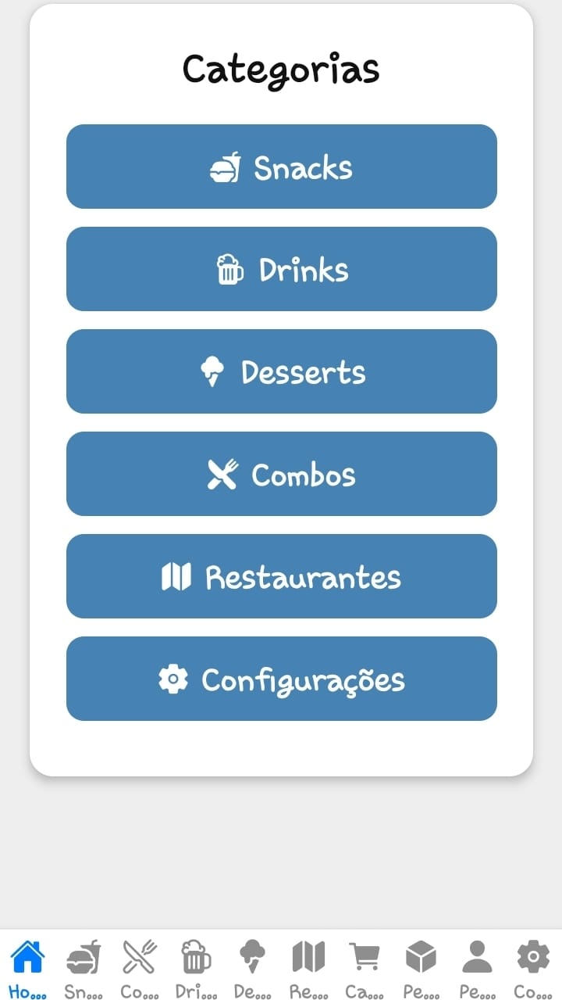
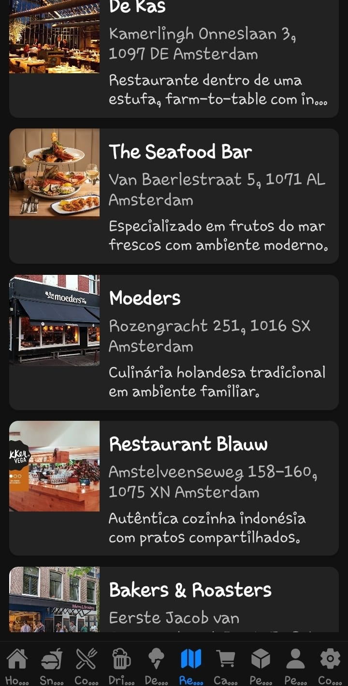
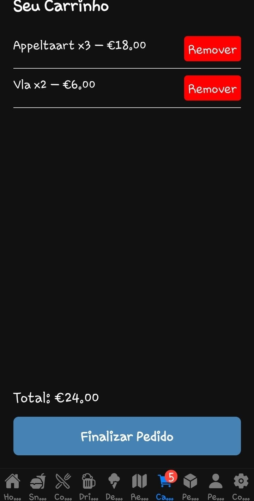

# InfnetFood

InfnetFood is a React Native app developed as part of the Mobile Development course.  
The project simulates a food delivery service with products, shopping cart, orders, and a profile area.  

---

## Features

- 📱 Navigation with bottom tabs  
- 🍔 Categories: Snacks, Drinks, Desserts, Combos  
- 🛒 Shopping cart with quantities and total price  
- 📦 Orders history  
- 👤 Profile with avatar and settings  
- ⚙️ Dark mode and light mode toggle  
- 🗺️ Delivery region map with restaurants  
- ✅ Checkout flow with confirmation  

<p float="left">
  
  
  
</p>
---

### Português

InfnetFood é um aplicativo em React Native desenvolvido como parte da disciplina de Desenvolvimento Mobile.  
O projeto simula um serviço de delivery com produtos, carrinho de compras, pedidos e área de perfil.  

---

## Funcionalidades

- 📱 Navegação com abas inferiores (bottom tabs)  
- 🍔 Categorias: Snacks, Drinks, Desserts, Combos  
- 🛒 Carrinho de compras com quantidades e preço total  
- 📦 Histórico de pedidos  
- 👤 Perfil com avatar e configurações  
- ⚙️ Alternância entre tema escuro e claro  
- 🗺️ Mapa de região de entrega com restaurantes  
- ✅ Fluxo de checkout com confirmação  

<p float="left">
  
  
  
</p>

---

## How to Run / Como Executar

1. Clone this repository:  
   ```bash
   git clone https://github.com/FernandoFogaca/infnetfood.git
